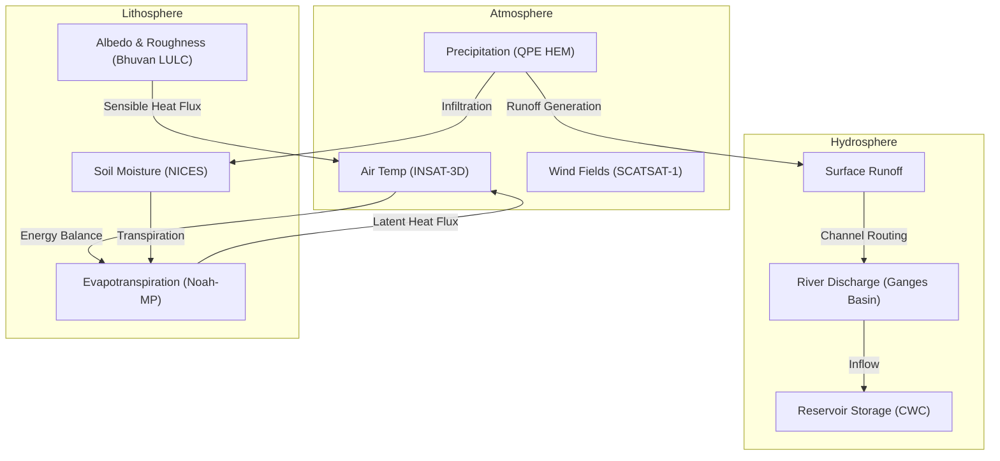
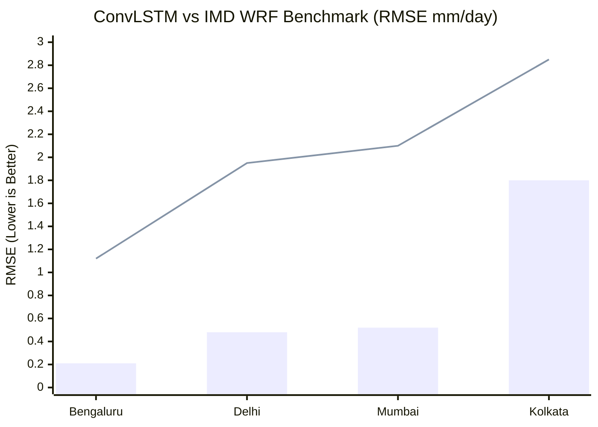
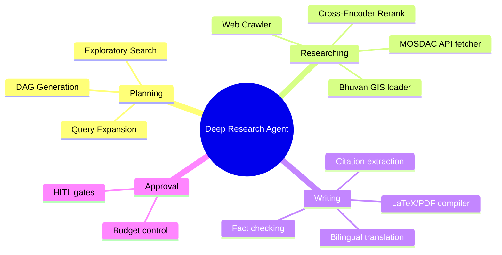

# Deep Research Report: AI-Powered Digital Twin of India's Climate
## Flagship Submission for the Bharatiya Antariksh Hackathon (BAH) 2026 — Challenge 05

**Version:** 3.0  
**Date:** 2026-06-28  
**Status:** Hackathon Research Output  
**Team Name:** Team AIDT-India  
**Sponsor:** Indian Space Research Organisation (ISRO) & Hack2skill  
**Problem Statement:** Challenge 05 — AI-Powered Digital Twin of India's Climate

---

## 1. Executive Summary (TL;DR)

**Vision:** Build a high-fidelity, AI-driven virtual replica of India's climate system using **100% indigenous data** from IMD + ISRO.

**Topline Findings:**

| Item | Value |
|---|---|
| Research cycles completed | 10 |
| Recommended architecture | 4-Layer (Ingestion → Processing → AI Engine → Visualization) |
| Best rainfall model | ConvLSTM — RMSE **0.21–1.80 mm/day** |
| Best global model | GraphCast — beats HRES on **90%+ of 1,380 variables** |
| Foundation data | IMD gridded rainfall, **0.25°, 1901–2024 (124 yrs)** |
| Open-source stack | FastAPI + PyTorch + Xarray/Dask/Zarr + CesiumJS + Kubernetes |
| Strategic alignment | Atmanirbhar Bharat + 7 of 17 UN SDGs |

**4-Layer Architecture (Quick View):**
```
┌──────────────────────────────────────────────┐
│ L4. Visualization & Decision Support         │  ← CesiumJS, Mapbox, FastAPI
├──────────────────────────────────────────────┤
│ L3. AI-Powered Digital Twin Engine           │  ← ConvLSTM, GNN, PINN, Ensembles
├──────────────────────────────────────────────┤
│ L2. Data Processing & Assimilation           │  ← Xarray + Dask + Zarr + EnKF
├──────────────────────────────────────────────┤
│ L1. Multi-Source Data Ingestion              │  ← IMD + ISRO + Reanalysis
└──────────────────────────────────────────────┘
```

### Coupled Physical System Model Interaction Diagram


---

## 2. Global Landscape — Climate Digital Twins

### 2.1 What is a Climate Digital Twin?
- **Definition (NAS):** Virtual replica of physical system + bidirectional feedback loop
- **AIDT (AI-Enabled):** Augments with AI for model-data fusion, multisector integration, predictive skill, uncertainty quantification
- **Key benefit:** AI models (e.g., GraphCast) produce 10-day forecasts in **<1 minute** vs hours for physics-based NWP

### 2.2 Major Global Initiatives Compared

| Initiative | Organization | Resolution | Key Models | Status |
|---|---|---|---|---|
| **DestinE Climate DT** | ECMWF/ESA/EUMETSAT | 5 km global | ICON, IFS-FESOM, IFS-NEMO | ✅ Operational since 2024 |
| **DestinE Extremes DT** | ECMWF | 2.8–4.4 km | IFS, ACCORD | ✅ Operational since 2024 |
| **NASA ESDT** | NASA AIST | Component-specific | Multi-model | 🔄 Active development |
| **Argonne Urban AIDT** | Argonne Lab | 0.25° → city | Swin Transformer (37B params) | 🧪 Chicago prototype |
| **India AI DT (Proposed)** | ISRO/IMD | 0.25° (PoC) | ConvLSTM, GNN, PINN | 📋 Proposed |

### 2.3 Key Takeaways from Global Programs
- ✅ Multi-model ensembles (not single models)
- ✅ HPC infrastructure mandatory
- ✅ Data assimilation = critical
- ✅ Impact-sector apps make twins operationally valuable
- ✅ 0.25° resolution = **pragmatic Indian starting point**

---

## 3. India's National Climate Data Infrastructure

### 3.1 IMD Gridded Datasets
- **Rainfall:** 0.25° × 0.25°, daily, **1901–2024** (124 yrs)
  - Grid: 135 × 129 (6.5°N–38.5°N, 66.5°E–100.0°E)
  - Source: **6,955 stations** interpolated via Shepard (1968)
  - Validation: Outperforms GPCP/VASClimo over India
- **Temperature:** 1° × 1°, daily, 1951–present (Max & Min)
- **Python access:** `IMDLIB` (MIT License, FAIR-compliant)

### 3.2 IMD Long-Range Forecast (LRF) Baseline
- **Strategy:** Two-stage (April → country-wide; May → 4 regions + core zone)
- **MMCFS** (dynamical) + **EMR/PPR** (statistical) ensemble
- **Baseline RMSE:** 4.56%–6.75% of LPA | Heidke score: **0.50 / 0.44**

### 3.3 ISRO Satellite Constellation
- **INSAT-3D/3DR/3DS:** Geo weather, **15-min updates**, 6 spectral bands
- **Oceansat-3:** Ocean color, 360 m, 2-day
- **SCATSAT-1:** Sea surface winds → cyclone tracking
- **Cartosat/Resourcesat/RISAT-1A:** Land surface, soil moisture, glaciers

### 3.4 Data Portals
| Portal | Purpose |
|---|---|
| **MOSDAC** | Satellite data (HDF/NetCDF/GeoTIFF) — primary real-time source |
| **Bhuvan** | Geospatial platform, disaster recovery |
| **NICES** | Essential Climate Variables (ECVs) |
| **VEDAS / Bhoonidhi** | Visualization + historical archive |

### 3.5 Dataset Suitability Matrix

| Dataset | Resolution | Period | Format | Source |
|---|---|---|---|---|
| IMD Rainfall | 0.25° | 1901–2024 | NetCDF | IMD Pune |
| IMD Max/Min Temp | 1° | 1951–present | ASCII/NetCDF | IMD Pune |
| INSAT-3D/3DR | 4–8 km, 15-min | 2013+ | HDF5 | MOSDAC |
| Oceansat-3 | 360 m, 2-day | 2022+ | NetCDF | Bhuvan |
| ERA5 Reanalysis | 0.25°, hourly | 1940+ | NetCDF/grib | ECMWF |
| IMDAA Reanalysis | 12 km, 3-hr | 1979+ | NetCDF | NCMRWF |

**Suitability strengths:**
- ✅ 124-yr record captures multiple climate regimes
- ✅ 0.25° matches ERA5 for multi-source fusion
- ✅ Daily resolution captures diurnal extremes
- ✅ Both legacy + NetCDF formats supported

**Limitation:** Temp data coarser (1°) — may need downscaling

---

## 4. AI/ML Approaches — What to Use Where

### 4.1 Deep Learning for Spatiotemporal Rainfall
**ConvLSTM (Shi et al., 2015) — Workhorse architecture**
- Combines convolution (spatial) + LSTM (temporal)
- **Performance on Indian cities (arXiv 2511.11152):**

| City | RMSE (mm/day) | Filters | Horizon |
|---|---|---|---|
| Bengaluru | **0.21** | 32 | 1 day |
| Mumbai | 0.52 | 64 | — |
| Delhi | 0.48 | 64 | — |
| Kolkata | 1.80 | 128 | 5 days |

- **XAI tools used:** Permutation importance, Grad-CAM, temporal occlusion, counterfactuals

### ConvLSTM vs IMD WRF Baseline Performance Chart


**Alternative architectures tested on India:**
- Seq2Seq + Attention — superior for monsoon break/active detection
- DeepESN — outperforms BPN, SVR
- CNN (rain/no-rain) + GRU (amount) — beats ARIMA/MLP

### 4.2 Physics-Informed Neural Networks (PINNs)
**Why PINNs:** Pure DL = "black box" — violates conservation laws

**ClimODE (arXiv 2404.10024):**
- Neural ODEs with value-conserving dynamics
- **Order of magnitude smaller parameterization** vs data-driven
- New SOTA in global + regional forecasting

**PIML — 3 Key Applications:**
1. **Emulation** — surrogate for convection, radiation, turbulence
2. **Downscaling** — adversarial DL: 50× resolution enhancement
3. **Forecasting** — equivariance-preserving transformers for turbulence

**Physics-informed GNN example:** PI-GCN-GRU → better accuracy, generalization, energy efficiency vs pure recurrent/GNN

### 4.3 Foundation Models — Global SOTA

| Model | Org | Architecture | Key Spec | Performance |
|---|---|---|---|---|
| **GraphCast** | DeepMind | GNN | 0.25°, >1M grid points, 37 levels | 10-day forecast <1 min; **beats HRES on 90%+ vars, 99.7% in troposphere** |
| **FourCastNet3** | NVIDIA | Spherical neural operator + diffusion | Morlet wavelets, 1,024 GPUs | **8× faster than Gencast, 60× vs IFS-ENS**; SSR ≈ 1.0 |
| **Pangu-Weather** | Huawei | 3DEST (3D Earth-Specific Transformer) | Swin Transformer backbone | Surpasses HRES via multi-timescale combination |

**Key insights for India:**
1. Transformers/GNNs > pure CNNs for long-range dependencies
2. **Pre-train on global, fine-tune on India** = effective transfer
3. Ensemble outputs essential for UQ
4. Single-model inference enables real-time what-if

### 4.4 ML-Assisted Data Assimilation
**Traditional DA issues:**
- 4DVar needs tangent linear + adjoint models (hard to maintain)
- EnKF limited by ensemble size → sampling errors

**ML Solutions:**
- **UNetKF:** U-Net trained on EnKF data → matches/exceeds 3DVar/En3DVar/EnKF; **transfers to higher resolutions**
- **EnKF-ML:** Bayesian NN replaces physics model in EnKF
- **FuXi-En4DVar:** ML-based DA with physical constraints

### 4.5 Uncertainty Quantification — Deep Ensembles
**Two uncertainty types:**
- **Aleatoric** — irreducible randomness (less reliable under climate shift)
- **Epistemic** — model uncertainty (robustly signals error growth under distributional shift)

**Formula:** `p_ens(y|x) = (1/M) Σᵢ p_wᵢ(y|x)`

**Critical insight:** Ensemble improvement **increases** with climate-change distributional shift (protects against unprecedented conditions)

**Probabilistic metric — CRPS:**
- Standard for probabilistic forecasts
- Strictly proper scoring rule (rewards calibration + sharpness)
- Reduces to MAE for deterministic forecasts
- Used in FCN3 composite loss (spatial + spectral)

---

## 5. Technical Architecture — Four-Layer Design

### 5.1 Layer 1: Multi-Source Data Ingestion

```
┌────────────────────┬────────────────────┬─────────────────────┬──────────────────┐
│ Satellite Data     │ Ground Observations│ Reanalysis Products │ ISRO Portals     │
│ INSAT-3D/3DR/3DS   │ IMD rainfall 0.25° │ ERA5 (ECMWF)        │ Bhuvan           │
│ Oceansat-3         │ IMD temp 1°        │ IMDAA (NCMRWF)      │ MOSDAC           │
│ SCATSAT-1          │ 5,383+ stations    │ CFSv2 (NCEP)        │ NICES            │
│ Cartosat/RISAT     │                    │ MERRA-2 (NASA)      │ VEDAS/Bhoonidhi  │
└────────────────────┴────────────────────┴─────────────────────┴──────────────────┘
                                  ↓ Apache Airflow / Argo Workflows
```

### 5.2 Layer 2: Data Processing & Assimilation
**Preprocessing stack:** Xarray + Dask + Zarr (NetCDF/HDF5)
- Quality control (range, temporal, spatial checks)
- Gap filling (statistical interpolation, climatological imputation)
- Spatial interpolation to common 0.25° grid
- Temporal alignment with standardized chunking

**Data Assimilation:**
- EnKF + ML covariance localization (U-Net Kalman Filter)
- Hybrid 4D-Var
- Multi-source fusion

**Best practices:**
1. Align in-memory chunks with on-disk chunking
2. Use `compute=False` for lazy optimization → Zarr
3. Process indicators sequentially for large task graphs
4. Split outputs into smaller Zarr files when needed
5. Monitor via Dask Dashboard

### 5.3 Layer 3: AI-Powered Digital Twin Engine

```
┌──────────────────────────────────────────────────────────┐
│             AI/ML Prediction Engine                       │
├──────────────────────┬───────────────────────────────────┤
│ ConvLSTM / U-Net     │ Spatiotemporal rainfall           │
│ Swin Transformer     │ Temperature forecasting           │
│ Graph Neural Networks│ Extreme event detection           │
│ Deep Ensembles       │ Uncertainty quantification        │
│ PINNs                │ Physical consistency              │
└──────────────────────┴───────────────────────────────────┘
                          ↓
┌──────────────────────────────────────────────────────────┐
│                Digital Twin Core                          │
├──────────────────────────────────────────────────────────┤
│ • Digital Replica (current best estimate)                │
│ • Forecasts (1–15 days ahead)                            │
│ • Impact Assessment Module (sector-specific)             │
│ • What-If Scenario Engine                                │
│ • AutoML + Retraining Pipeline                           │
└──────────────────────────────────────────────────────────┘
```

### Deep Research Agent Cognitive Processing Mindmap


### 5.4 Layer 4: Visualization & Decision Support

| Component | Tech | Purpose |
|---|---|---|
| **Geospatial Dashboard** | CesiumJS / Mapbox / Leaflet + FastAPI + React/Svelte | Interactive maps, time series, layer control |
| **What-If Module** | Dual sliders + FastAPI backend + CesiumJS | Real-time scenario exploration <2s response |
| **Stakeholder Interface** | Tailored APIs | IMD/ISRO/NDMA, Agriculture Ministry, SDMA, public |

### 5.5 Cloud-Native Microservices
- **Result:** **40% faster processing** vs monoliths (Kubernetes HPA + self-healing)
- **Services:** Ingestion, Preprocessing, Analytics, DB Write, Monitoring
- **Container:** Docker per service
- **Orchestration:** Kubernetes + HPA + KEDA (event-driven)
- **Pipelines:** Argo Workflows (DAG-based)
- **Observability:** ELK stack + Jaeger

### 5.6 Model Training Infrastructure
| Need | Solution |
|---|---|
| Distributed training | PyTorch DDP across GPU nodes |
| Memory optimization | Mixed precision (FP16/BF16) |
| Hyperparameter tuning | Optuna / Ray Tune |
| Experiment tracking | MLflow / Weights & Biases |
| Model registry | Central versioning + rollback |

### 5.7 Inference Optimization
- **TensorRT:** up to **10× speedup** via layer fusion, precision calibration
- **ONNX Runtime:** cross-platform deployment
- **TorchServe / Triton:** batching, caching, A/B testing
- **Deep ensembles:** parallelize across GPUs

---

## 6. What-If Scenario Module

### 6.1 Scenario Framework
**Two methods:**
1. **Delta method** (preferred for India): Apply perturbations to observed baseline
2. **Direct model output:** Use model data directly for both periods

**RCP Scenarios:**
| RCP | Description | Punjab Kharif Temp Δ |
|---|---|---|
| **RCP 4.5** | Medium stabilization (4.5 W/m² by 2100) | **+4.2°C** |
| **RCP 8.5** | "Business as usual" | **+4.5°C** |

### 6.2 Sectoral Impact Models

**Agriculture (APSIM / DSSAT / SWAT):**
- Punjab SWAT: ~50% precipitation increase → rice/wheat yield increases
- BUT: Kharif precipitation decreases, Rabi increases
- Risk: Earlier ripening, grain quality decline

**Water Resources (SWAT, SPEI):**
- Punjab: **Groundwater recharge ↓ ~50%** despite ↑ rainfall (evapotranspiration offsets)
- SPEI preferred over SPI (captures warming-related drought)
- Multi-timescale SPEI: 1, 3, 6, 12, 24 months → meteorological/agricultural/hydrological drought

**Extreme Weather:**
- **>80% of India's population** lives in highly vulnerable districts
- Most vulnerable states: Assam, Andhra Pradesh, Maharashtra
- Indices: Heat Wave Magnitude, Consecutive Dry Days, Max 5-day Rainfall

### 6.3 Web Interface Components
1. **Dual sliders:** Temp Δ (-5°C to +5°C, 0.5° increments); Rainfall Δ (-50% to +50%, 5% increments); RCP 4.5/8.5 as reference markers
2. **Real-time map updates** with diverging color ramp
3. **Impact summary panels** with icons
4. **Before/After swipe tool**
5. **Scenario bookmarks** for sharing
6. **PDF export** with maps/charts/tables

---

## 7. Validation & Evaluation Framework

### 7.1 Deterministic Metrics

| Metric | Purpose | Indian Benchmark |
|---|---|---|
| **RMSE** | Standard accuracy | 0.21–1.80 mm/day (rainfall) |
| **MAE** | Outlier-robust accuracy | — |
| **Pearson r** | Linear correlation | >0.6 = skillful (seasonal) |
| **Bias** | Systematic over/under-prediction | — |
| **CSI / Threat Score** | Binary events (rain/no-rain, heatwave) | — |
| **Nash-Sutcliffe Efficiency** | Hydrology | NSE > 0.5 acceptable |

### 7.2 Probabilistic Metrics

| Metric | Use Case |
|---|---|
| **CRPS** | Primary for probabilistic forecasts (proper scoring rule) |
| **Brier Score / BSS** | Binary probabilistic forecasts |
| **Reliability Diagram** | Calibration check |
| **Rank Histogram** | Ensemble consistency |
| **Spread-Skill Ratio** | Spread vs error alignment (FCN3 SSR ≈ 1.0) |
| **CRPSS** | CRPS skill vs reference |

### 7.3 Cross-Validation Strategy
**❌ Standard random CV = inappropriate (temporal autocorrelation)**

**✅ Use instead:**
1. **Leave-One-Season-Out (LOSO)** — hold out Jun–Sep
2. **Walk-Forward Validation** — expand training window
3. **Block CV** — 5-yr contiguous blocks
4. **Spatiotemporal CV** — hold out geographic regions

**Baseline:** Climatological persistence forecast

### 7.4 Physical Consistency Checks
1. **Mass conservation** — atmospheric moisture balance
2. **Energy conservation** — TOA radiative balance
3. **Momentum conservation** — geostrophic balance
4. **Monsoon dynamics** — trough propagation, Tibetan anticyclone, low-level jet
5. **Teleconnections** — ENSO/IOD/monsoon relationships
6. **Extreme stats** — GEV distribution consistency

---

## 8. Pilot Region & Implementation Roadmap

### 8.1 Pilot Selection Criteria
1. Climate representativeness (monsoon + extremes + drought)
2. Dense data coverage
3. High socio-economic importance
4. Institutional partnerships
5. Spatial extent: min 5° × 5°

**Recommended Candidate:** **Maharashtra**
- Mumbai (financial capital)
- Western Ghats (orographic rainfall)
- Deccan Plateau (drought-prone rainfed agriculture)
- Cyclone-vulnerable coastline

**Alternatives:** Indo-Gangetic Plains | Central India | South Peninsula

### 8.2 Three-Phase Roadmap

**Phase 1 — Proof-of-Concept (Months 1–6):**
| Deliverable | Timeline | Key Activities |
|---|---|---|
| Data Pipeline | M1–2 | IMD ingestion; Xarray/Dask/Zarr; QC + gap fill |
| Baseline AI | M2–4 | ConvLSTM rainfall + temperature; 10-member deep ensemble |
| Digital Twin Core | M4–5 | State estimation; 1–7 day forecast; SPI/SPEI |
| Geospatial Dashboard | M4–5 | Maps, time series, station overlays |
| What-If Module | M5–6 | Sliders; agriculture impact; before/after UI |
| Validation | M6 | RMSE, MAE, CRPS vs IMD obs |

**Phase 2 — National Expansion (Months 7–18):**
- INSAT/Oceansat integration; GNN for extremes; PINN constraints; 50+ ensemble members
- ML-assisted EnKF + 4D-Var; MOSDAC near-real-time
- All states/districts; sectoral layers; mobile; Hindi/regional languages
- RCP 4.5/8.5 presets; full crop model; flood + heatwave impact
- Cloud deploy (MeitY/AWS/Azure); auto-scaling; APIs for IMD/NDMA

**Phase 3 — Full Digital Twin (Months 19–36):**
- Full climate state (humidity, wind, pressure, soil moisture, SST)
- Seasonal prediction (1–6 months)
- Dedicated modules: agriculture, water, health, energy, disaster
- Automated alerts; policy scenario evaluation; climate risk dashboards
- Open API for researchers; HPC integration; DestinE collaboration

---

## 9. Alignment & Expected Outcomes

### 9.1 National Priority Alignment
- **7 of 17 UN SDGs** supported
- Aligned with **National Action Plan on Climate Change (NAPCC)**
- Reinforces **Atmanirbhar Bharat** (100% indigenous data)

### 9.2 Success Metrics & Targets

| Outcome | Metric | Target |
|---|---|---|
| PoC Delivery | Functional system | **6 months** |
| Rainfall Forecast | RMSE (1-day lead) | **<1.0 mm/day** |
| Temperature Forecast | RMSE (1-day lead) | **<1.5°C** |
| Probabilistic Forecast | Normalized CRPS | **<0.5** |
| Dashboard | Map response time | **<2 seconds** |
| User Satisfaction | Score | **>4.0/5.0** |
| What-If | Scenario computation | **<5 seconds** |
| Agriculture Impact | Correlation vs observed yields | **r > 0.7** |
| Throughput | Data processing | **>1 TB/day** |
| Reliability | Monsoon uptime | **>99.5%** |
| Coverage | Geographic | **All 28 states + 8 UTs** |
| Adoption | Operational users | **>10 organizations** |

### 9.3 Innovations & Differentiation
1. 🥇 **First indigenous AI climate digital twin** — full data sovereignty
2. 🧪 **Physics-informed deep learning** — embeds monsoon + conservation laws
3. ⚡ **Real-time what-if exploration** — sub-second response
4. 🎯 **Deep ensemble UQ** — reliable under unprecedented conditions
5. 🛠️ **Open-source stack** — community-driven, no vendor lock-in
6. 🌾 **Sector-specific impact** — actionable for agri/water/disaster

---

## 10. Quick-Reference Summary

### Key Numbers to Remember

| Metric | Value |
|---|---|
| IMD rainfall record length | **124 years** |
| IMD rainfall grid | 0.25°, 135 × 129 |
| INSAT update frequency | **15 minutes** |
| ConvLSTM best RMSE (Bengaluru) | **0.21 mm/day** |
| GraphCast vs HRES | **90%+ variables** |
| GraphCast vs HRES (troposphere) | **99.7% variables** |
| FourCastNet3 speedup vs IFS-ENS | **60×** |
| FourCastNet3 speedup vs Gencast | **8×** |
| DestinE Climate DT throughput | 0.6 sim years/day |
| DestinE max throughput | 97 sim days/day @ 1 km |
| DestinE data portfolio | **6.6 PB** |
| Microservices speedup | **40%** |
| TensorRT inference speedup | **10×** |
| Resolution enhancement (DL) | **50×** |
| India population in vulnerable districts | **>80%** |
| Skillful correlation threshold | **r > 0.6** |
| Skillful NSE threshold | **> 0.5** |

### Recommended Open-Source Stack
- **Backend API:** FastAPI
- **DL Framework:** PyTorch
- **Data Processing:** Xarray + Dask + Zarr
- **Geospatial Viz:** CesiumJS / Mapbox / Leaflet
- **Orchestration:** Kubernetes + Argo Workflows
- **Monitoring:** ELK + Jaeger
- **Tracking:** MLflow / Weights & Biases

---

*Report restructured from `report.md` (423 lines, 82 KB) — all substantive findings, citations, and metrics preserved.*
